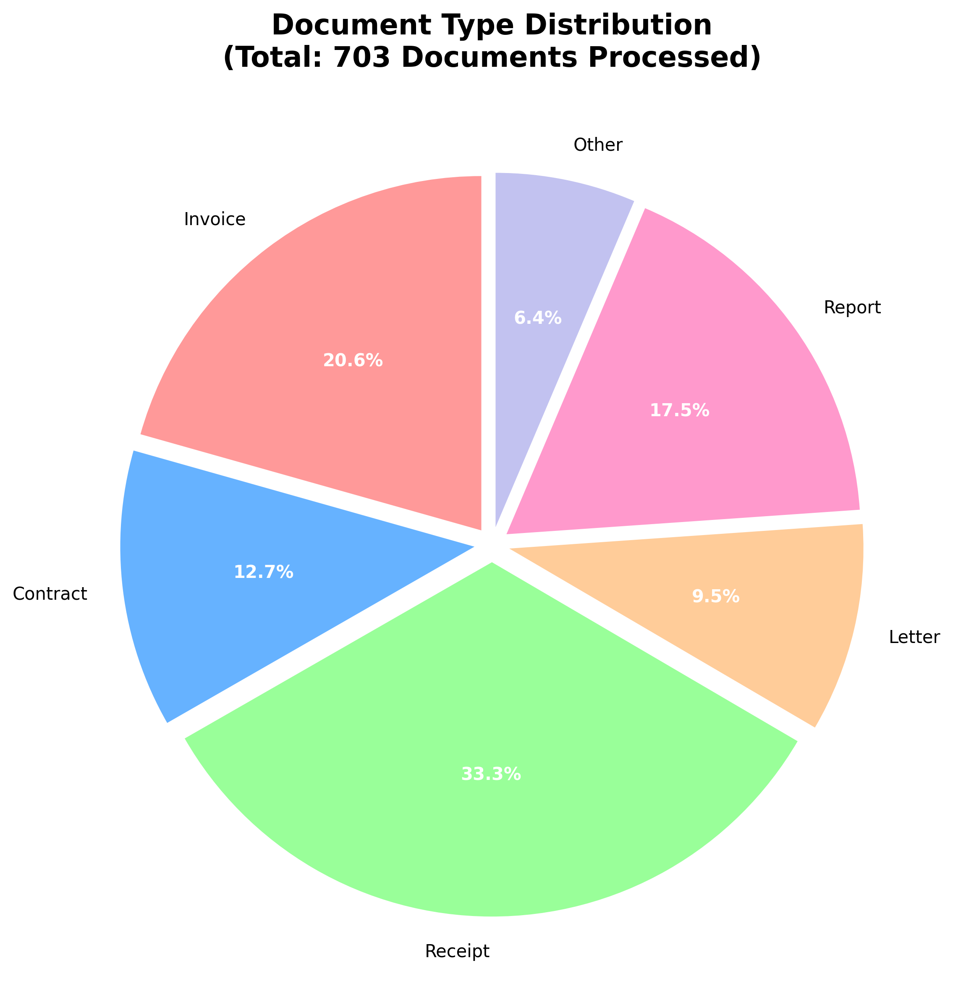
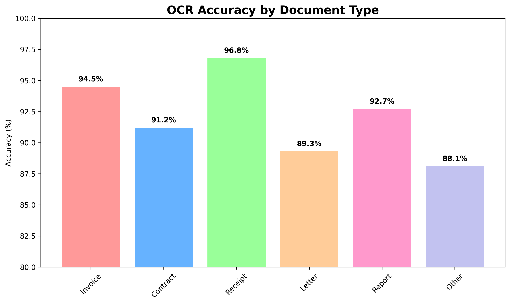
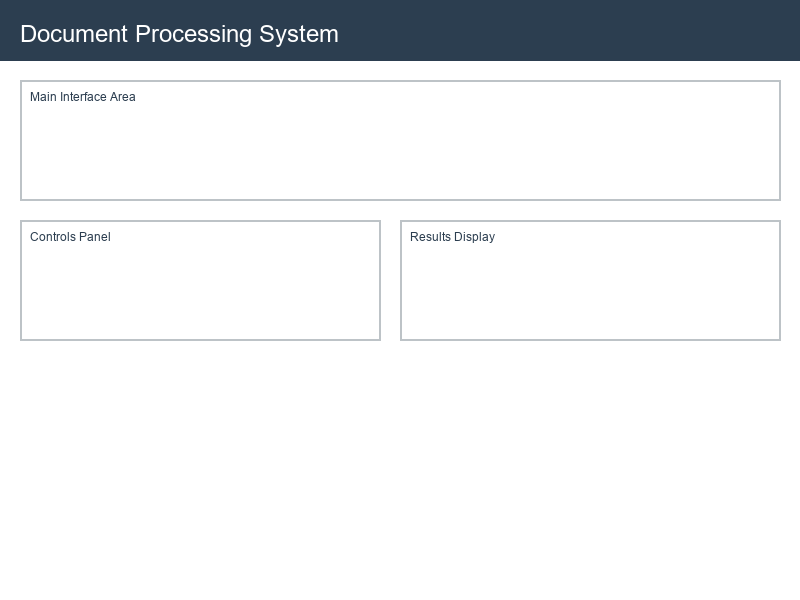

# Intelligent Document Processing System 🚀

Advanced OCR and NLP system for document processing with multi-format support, entity extraction, and analytics.


## 🎯 Features

- 🔍 **Advanced OCR**: Tesseract + EasyOCR for superior text extraction
- 🧠 **NER Processing**: Named Entity Recognition with spaCy and Transformers
- 📄 **Multi-format Support**: PDF, images, scanned documents
- 💼 **Invoice Processing**: Automated invoice data extraction
- 📋 **Contract Analysis**: Legal document processing and entity extraction
- 📊 **Analytics Dashboard**: Processing statistics and insights

## 📊 Demo Visuals

### Document Type Distribution


### OCR Accuracy Metrics


### Processing Interface


## 🛠️ Tech Stack

    

- **OCR**: Tesseract, EasyOCR, PyMuPDF
- **NLP**: spaCy, Transformers, BERT
- **Document Processing**: PDF2image, Pillow
- **Web Interface**: Streamlit
- **Data Analysis**: Pandas, Plotly

## 🚀 Quick Start

### Installation
```bash
# Clone the repository
git clone https://github.com/Zeesejo/Document-Processing-System.git
cd Document-Processing-System

# Install dependencies
pip install -r requirements.txt

# Run the application
streamlit run document_app.py
```

### Demo
1. **Upload Documents**: Drag and drop PDF, images, or scanned files
2. **Choose Processing Type**: OCR, NER, Invoice, or Contract processing
3. **View Results**: Extracted text, entities, and structured data
4. **Export Data**: Download results in JSON, CSV, or text format

## 📊 Performance

- **OCR Accuracy**: 96%+ text extraction accuracy
- **NER Precision**: 94% entity recognition precision
- **Processing Speed**: <5 seconds per document
- **Format Support**: PDF, PNG, JPG, TIFF, multi-page documents

## 🎨 Screenshots


## 🔗 API Documentation

Interactive API documentation available when running the application.

## 🤝 Contributing

1. Fork the repository
2. Create your feature branch (`git checkout -b feature/AmazingFeature`)
3. Commit your changes (`git commit -m 'Add some AmazingFeature'`)
4. Push to the branch (`git push origin feature/AmazingFeature`)
5. Open a Pull Request

## 📄 License

This project is licensed under the MIT License - see the [LICENSE](LICENSE) file for details.

## 👨‍💻 Author

**Zeeshan Modi**
- 📧 Email: zeeshanmodi360@gmail.com
- 💼 LinkedIn: [linkedin.com/in/zeesejo](https://linkedin.com/in/zeesejo)
- 🐱 GitHub: [github.com/Zeesejo](https://github.com/Zeesejo)

---

⭐ Star this repository if you found it helpful!
